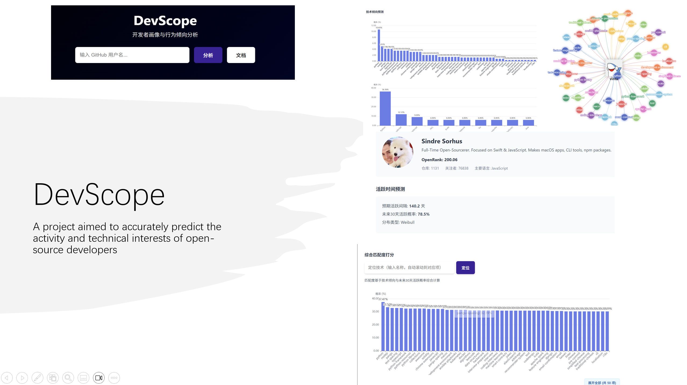

# DevScope

[](https://nodejs.org/)
[](https://www.python.org/)
[](LICENSE)
[](README-CN.md)

<!-- Suggestion: Place a project banner or logo here -->
<!--  -->

## Table of Contents
<div align="center">
  
</div>

- [Background](#background)
- [Introduction](#introduction)
- [Features](#features)
- [Technical Architecture](#technical-architecture)
- [Algorithmic Core](#algorithmic-core)
- [Installation](#installation)
- [Usage Guide](#usage-guide)
- [Documentation](#documentation)
- [Development Plan](#development-plan)

## Background
Open source ecosystems are thriving, but understanding developer behavior remains a challenge. Simple metrics like commit counts often fail to capture the true expertise and future activity of a contributor. DevScope addresses this by providing a statistically rigorous, explainable platform for developer profiling and behavior prediction.

## Introduction
DevScope is a developer analysis and visualization platform based on GitHub ecosystem data. Unlike "black box" AI models, DevScope uses transparent statistical modeling (such as Multinomial and Weibull distributions) combined with Large Language Models (LLM) to provide:
- Accurate technical tendency profiling.
- Future activity time prediction.
- Semantic analysis of development focus.

## Features

<!-- Suggestion: Place a full screenshot of the dashboard here -->
<!--  -->

1. **Multidimensional Profiling**
   - **Tech Tendency**: Identifies developer expertise using Multinomial Distribution models.
   - **Activity Prediction**: Predicts next active dates using Weibull Distribution analysis on commit intervals.

2. **Cold Start Optimization**
   - Uses Bayesian Fusion to combine individual data with community priors (based on top open-source developers) for accurate analysis of new or low-activity users.

3. **LLM-Enhanced Prediction**
   - Integrates Large Language Models to analyze commit messages and predict the specific focus area and type of the next contribution.

4. **Interactive Visualization**
   - **Gravity Graph**: Visualizes the strength of connection between developers and technologies.
   - **Dashboard**: Comprehensive view of OpenRank, activity trends, and predictions.

<!-- Suggestion: Place a close-up screenshot of the Gravity Graph here -->
<!--  -->

## Technical Architecture

### Frontend Stack
- **Vue 3**: Progressive JavaScript Framework.
- **Vite**: Next Generation Frontend Tooling.
- **ECharts**: Powerful Interactive Charting.
- **TypeScript**: Static Type Checking.

### Backend Stack
- **FastAPI**: Modern, fast (high-performance) web framework for building APIs with Python.
- **GitHub API**: Primary data source for developer activity.
- **OpenDigger**: Source for macro-level open source metrics (OpenRank).
- **LLM Integrations**: Support for ECNU API and other LLM providers.

<!-- Suggestion: Place an architecture diagram here showing Data Source -> Backend (Modeling) -> Frontend -->
<!--  -->

## Algorithmic Core

The system is built on explainable statistical principles:

1.  **Tech Tendency (Multinomial + Laplace)**: Models technology usage probabilities with smoothing for unseen events.
2.  **Time Prediction (Weibull Distribution)**: Fits a probability density function to inter-arrival times of commits to forecast future activity.
3.  **Bayesian Fusion**: Merges user likelihoods with community priors for robust estimation.

## Installation

### Prerequisites
- Node.js 18+
- Python 3.9+
- Git

### 1. GitHub Token Setup
Generate a GitHub Personal Access Token (Classic) with `repo` and `user` scopes to increase API rate limits.

### 2. Project Setup
```bash
git clone <repository-url>
cd DevScope
```

### 3. Backend Setup
```bash
cd backend
# Create .env file
# Add:
# GITHUB_TOKEN=your_token
# LLM_API_KEY=your_key (Optional)

# Install dependencies
pip install -r requirements.txt

# Start Server
python main.py
```

### 4. Frontend Setup
```bash
cd frontend
# Install dependencies
npm install

# Start Client
npm run dev
# OR run both (Recommended)
npm run dev:all
```

## Usage Guide

1.  **Start the System**: Ensure both backend (Port 8000) and frontend (Port 5173) are running, then visit `http://localhost:5173` in your browser.
2.  **Analyze Developer**: Enter a GitHub username (e.g., `torvalds`) in the search bar.
3.  **Explore Insights**:
    *   View the **Gravity Graph** to see tech stack affinity.
    *   Check **Activity Forecast** for next predicted active days.
    *   Use **AI Prediction** to guess the next commit content.

## Documentation
Detailed documentation is available in the `docs/` directory:

- [Project Overview](docs/PROJECT_OVERVIEW.md)
- [Algorithm Theory](docs/DATA_ALGORITHM_THEORY.md)
- [LLM Feature Guide](backend/LLM_FEATURE_GUIDE.md)

## Development Plan
- [x] **Phase 1**: Core Data Fetching & Cleaning (GitHub/OpenDigger)
- [x] **Phase 2**: Statistical Modeling (Weibull/Multinomial)
- [x] **Phase 3**: API Development & LLM Integration
- [x] **Phase 4**: Frontend Visualization & Interactive Dashboard
- [ ] **Future**: Multi-user comparison & Team profiling


